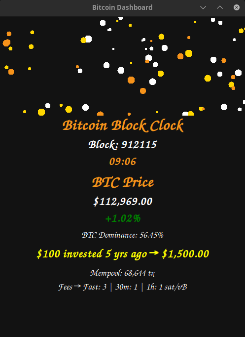

# Bitcoin Dashboard

An interactive Bitcoin dashboard built in Python. Track live BTC price, dominance, mempool stats, transaction fees, and the `$100 invested 5 years ago` tracker.

## Features
- Live Bitcoin price
- BTC dominance
- Current block height and countdown to next block
- Mempool stats and fees
- `$100 invested 5 years ago` tracker

## Requirements
- Python 3
- Python dependencies:
  - [`requests`]
  - [`tkinter`] (GUI lib)

## Usage
python3 bitcoin_block_clock.py

## 🍻 Support / Tip Jar

This project is free and will always be free — enjoy! 🙂
If it saved you time or made bitcoin tracking a little easier, and you’d like to buy me a beer (totally optional), you can tip here:

- **Bitcoin (on-chain):** `bc1qxzgdwc9pgggram8jtnhsmrhdk5pvw8tx6h7qmj`
- **Bitcoin Lightning:** `cloudyhubcap91@walletofsatoshi.com`
- **Monero (XMR):** `4BHHdsAN5FCYgj65PyG6DP7P4H3xgNcxUKtnSddmwM7aV5CQbEz37L3NrN68UAeNm3B7PL9TeaJwYAkjQqFdc8go7gz9ymK`
